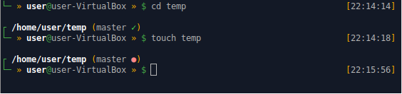
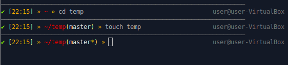

# my-zsh-themes

## Information

This folder contains all my zsh themes and a small script that can install them and set-up oh-my-zsh

## Install

just run as non root user :
```
chmod +x install.sh
./install.sh
```

## Themes

### oseda



### af-magic-custom


